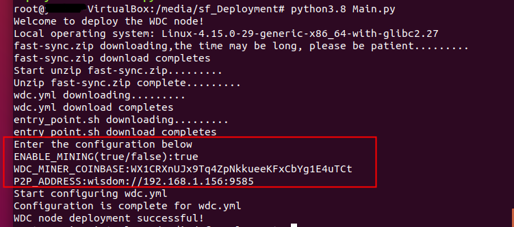

# 2. WisdomChain Client
## 2.1 Client Type
&#160;&#160;&#160;&#160;&#160;&#160;Full nodes and miner nodes
## 2.2 Core Node Deployment
### 2.2.1 Configure Network Firewall
&#160;&#160;&#160;&#160;&#160;&#160;The default port of WisdomChain P2P and RPC is 19585, which can be modified according to the requirements when the docker container port is mapped. Please modify the network firewall settings as required to decide whether to open the port.

### 2.2.2 Server Hardware
&#160;&#160;&#160;&#160;&#160;500GB of disk space, 16GB of memory, and 8 cores of CPU are recommended.

### 2.2.3 Install docker、docker-compose

#### 	2.2.3.1 Ubuntu

```
apt install -y docker-compose
```

#### 	2.2.3.2 CentOS

```
yum install -y docker

sudo curl -L "https://github.com/docker/compose/releases/download/1.24.0/docker-compose-$(uname-s)-$(uname-m)" -o/usr/local/bin/docker-compose

sudo chmod +x /usr/local/bin/docker-compose
```

### 2.2.4 Docker Mirror Address
&#160;&#160;&#160;&#160;&#160;&#160;		Node program mirroring：wisdomchain/wdc_core

&#160;&#160;&#160;&#160;&#160;&#160;
Database mirroring：wisdomchain/wdc_pgsql

### 2.2.5 wdc.ymlFile Example
<font color=red>* The following content is sample content. During actual deployment, volume mapping, environment variables, port mapping, etc. need to be adjusted according to the actual situation.</font>

```yml
version: '3.1'

services:

    wdc_pgsql:
        image: wisdomchain/wdc_pgsql
        restart: always
        container_name: wdc_pgsql
        privileged: true
        volumes:
            -/opt/wdc_pgsql:/var/lib/postgresql/data # pgsql Data catalog
        ports:
            -127.0.0.1:5433:5432
        environment:
            POSTGRES_USER: wdcadmin
            POSTGRES_PASSWORD: PqR_w9hk6Au-jq5ElsFcEjq!wvULrYXeF3*oDKp5i@A/D5m03VaB1M/hyKY
            WDC_POSTGRES_USER: replica
            WDC_POSTGRES_PASSWORD: replica

    wdc_core:
        image: wisdomchain/wdc_core
        restart: always
        container_name: wdc_core
        privileged: true
        volumes:
            -/opt/wdc_logs:/logs #Program log directory
            -/opt/wdc_leveldb:/leveldb
            -./entry_point.sh:/entry_point.sh
            -/opt/ipc:/root/ipc
            -./libs:/libs
            -/opt/fast-sync:/fast-sync
        entrypoint: /usr/bin/env bash /entry_point.sh -d wdc_pgsql:5432 -c '/usr/bin/env bash /run_wdc_core.sh'
        ports:
            -19585:19585
            -9585:9585
        environment:
            LOGGING_CONFIG: 'https://wisdom-config.oss-cn-hangzhou.aliyuncs.com/public-chain/logback.xml' #If an error is reported in the related path of LOGGING_CONFIG, this item can be removed
            DATA_SOURCE_URL: 'jdbc:postgresql://wdc_pgsql:5432/postgres'
            DB_USERNAME: 'replica'
            DB_PASSWORD: 'replica'
            WDC_MINER_COINBASE: 'WX1********XN1T21573hYata'
            P2P_MODE: 'grpc'
            P2P_ADDRESS: 'wisdom://192.**.***.156:9585'
            BOOTSTRAPS: 'wisdom://47.74.183.249:9585,wisdom://47.74.216.251:9585,wisdom://47.96.67.155:9585,wisdom://47.74.86.106:9585'
            MAX_BLOCKS_PER_TRANSFER: '256'
            ENABLE_DISCOVERY: 'true'
            ENABLE_MINING: 'true'
            FAST_SYNC_DIRECTORY: '/fast-sync'
            DATABASE_DIRECTORY: '/leveldb'
```

### 2.2.6 Volume Mapping（volumes）
&#160;&#160;&#160;&#160;&#160;&#160;Map to different directories as needed.

&#160;&#160;&#160;&#160;&#160;&#160;Where, wdc_pgsql volumes maps the PostgreSql database data directory. After the docker container is deleted, the directory will not be deleted automatically, and the node data is still retained. If you want to restart WDC Core completely, after backing up the directory, delete or empty the directory.

&#160;&#160;&#160;&#160;&#160;&#160;wdc_core volumes maps the WDC Core node program log directory.

&#160;&#160;&#160;&#160;&#160;&#160;Some files inside the container can also be mapped to the host directory as required.For example, /fast-sync in wdc_core container can be mapped to /opt/fast-sync:/fast-sync.

### 2.2.7 Network Port Mapping（ports）
&#160;&#160;&#160;&#160;&#160;&#160;In order to ensure security, it is recommended to map the port of wdc_pgsql to IP address 127.0.0.1 and only allow local access. If you do not want to access the database through an external client, you can also remove the port mapping.

&#160;&#160;&#160;&#160;&#160;&#160;External port number of wdc_pgsql and wdc_core, which can be modified according to the demand

### 2.2.8 Environment Variable（environment）
&#160;&#160;&#160;&#160;&#160;&#160;The database user name and password can be customized, but it is necessary to ensure that WDC_POSTGRES_USER and DB_USERNAME are consistent, and WDC_POSTGRES_PASSWORD and DB_PASSWORD are consistent.

&#160;&#160;&#160;&#160;&#160;&#160;ENABLE_MINING indicates whether mining is started.

&#160;&#160;&#160;&#160;&#160;&#160;WDC_MINER_COINBASE is the mining coinbase address, which must be set, otherwise the node cannot be started. See the next section "miner address generation" for the method of generating address.

&#160;&#160;&#160;&#160;&#160;&#160;The value of  DATA_SOURCE_URL is interconnected with the docker container and does not need to be modified. If you need to modify, make sure that the host name in the URL is pgsql container name, and the port is the same as the database port inside the pgsql container.

&#160;&#160;&#160;&#160;&#160;&#160;BOOTSTRAPS：List of seed nodes, comma separated.

&#160;&#160;&#160;&#160;&#160;&#160;ENABLE_DISCOVERY：Whether the node discovery is allowed，true/false.

&#160;&#160;&#160;&#160;&#160;&#160;P2P_ADDRESS：Own node ip、port.

&#160;&#160;&#160;&#160;&#160;&#160;ports：9585 is p2p port and 19585 is rpc port.

&#160;&#160;&#160;&#160;&#160;&#160;MAX_BLOCKS_PER_TRANSFER：Maximum number of synchronization blocks (256 by default is recommended).

&#160;&#160;&#160;&#160;&#160;&#160;FAST_SYNC_DIRECTORY: '/fast-sync'：Snapshot file path (this path is the path within the container, which needs to be consistent with the mapping path under the configured volumes in wdc.yml).

&#160;&#160;&#160;&#160;&#160;&#160;DATABASE_DIRECTORY: '/leveldb'：leveldb Storage path (this path is the path within the container, which needs to be consistent with the mapping path under the configured volumes in wdc.yml.

### 2.2.9 Miner Address Generation
&#160;&#160;&#160;&#160;&#160;&#160; Use mobile app to generate address. App can be downloaded on the official website: https://www.wisdchain.com/

&#160;&#160;&#160;&#160;&#160;&#160;Currently, the download page is:  https://www.wisdchain.com/user/application_1

### 2.2.10 Prepare entry_point.sh
&#160;&#160;&#160;&#160;&#160;&#160;In the wdc.yml file, the entry script content of the wdc_core service:：

```shell
#!/bin/bash
#set -x
#******************************************************************************
# @file    : entrypoint.sh
# @author  : wangyubin
# @date    : 2018-08- 1 10:18:43
#
# @brief   : entry point for manage service start order
# history  : init
#******************************************************************************

: ${SLEEP_SECOND:=2}

wait_for() {
    echo Waiting for $1 to listen on $2...
    while ! nc -z $1 $2; do echo waiting...; sleep $SLEEP_SECOND; done
}

declare DEPENDS
declare CMD

while getopts "d:c:" arg
do
    case $arg in
        d)
            DEPENDS=$OPTARG
            ;;
        c)
            CMD=$OPTARG
            ;;
        ?)
            echo "unkonw argument"
            exit 1
            ;;
    esac
done

for var in ${DEPENDS//,/ }
do
    host=${var%:*}
    port=${var#*:}
    wait_for $host $port
done

eval $CMD

```

### 2.2.11 Data Snapshot：
Data snapshot download link:https://wisdom-backup.oss-cn-beijing.aliyuncs.com/fast-sync.zip
<br>Unzip and put the snapshot file in (official suggestion, you can customize the path and modified in wdc.yml if necessary) /opt/fast-sync path.
<br>If you have new data snapshots, please follow the official account.

### 2.2.12 Start Docker Image
&#160;&#160;&#160;&#160;&#160;&#160;Update image：
```
docker pull wisdomchain/wdc_core
	
docker pull wisdomchain/wdc_pgsql
	
docker-compose -f wdc.yml up -d
```

### 2.2.13 View Log
&#160;&#160;&#160;&#160;&#160;&#160;Command docker logs -f <CONTAINER ID> to view the output of the node program console. By default, directory /opt/wdc_logs is the node program log file directory mapped by volumes in the wdc.yml configuration file. If you have customized the path, go to the corresponding directory to view it.

## 2.3 Node Start Process

```
//Stop and delete the container, make sure the node is not started
docker-compose -f wdc.yml down

//Get the latest version image
docker pull wisdomchain/wdc_core

//Modify wdc.yml , if necessary

//Start new version image
docker-compose -f wdc.yml up -d
```
## 2.4 One-Click Deployment
### 2.4.1 Deployment Preparation
&#160;&#160;&#160;&#160;&#160;&#160;The official operating system is Linux ubuntu18+64 bit. After you prepare the operating system, you need to install and deploy Python. The minimum version of Python is 3.8.0. After the installation is successful, use Python 3.8 -- version to check whether the installation is normal (the installation mode is different, and the instructions are checked according to the installation mode).
</br>


&#160;&#160;&#160;&#160;&#160;&#160;Install docker and docker compose. For specific installation steps, please refer to 2.2.3 to install docker and docker compose.

### 2.4.2 Automated Deployment
Note: select root or a user with administrator rights to perform the following deployment
```python
#!/usr/bin/env python
# -*- coding: utf-8 -*-
# @Time    : 2020/03/30 10:01
# @Author  : Yun Min
# @File    : Main.py

import platform
import os
import os.path
import zipfile
import time
import json
import sys
import re
import ssl

from urllib import request

fast_url = "https://wisdom-backup.oss-cn-beijing.aliyuncs.com/fast-sync.zip"
root_dir = "/opt/"
fast_name = "fast-sync.zip"
wdc_url = "https://wisdom-backup.oss-cn-beijing.aliyuncs.com/wdc.yml"
wdctest_name = "wdc-test.yml"
wdc_name = "wdc.yml"
entrypoint_url = "https://wisdom-backup.oss-cn-beijing.aliyuncs.com/entry_point.sh"
entrypoint_name = "entry_point.sh"
envfile_name = "env.json"
profileList = {'ENABLE_MINING': '', 'P2P_ADDRESS': '', 'WDC_MINER_COINBASE': ''}
global numb
numb = 0
global count
count = 0

ssl._create_default_https_context = ssl._create_unverified_context


def main():
    print("Welcome to deploy the WDC node!")
    usePlatform()
    path = os.getcwd()
    os.chdir(root_dir)
    downloadFast()
    os.chdir(path)
    downloadWdc()
    propValue()
    updateWdc()
    print("WDC node deployment successful!")


def downloadWdc():
    try:
        if os.path.exists(wdctest_name):
            pass
        else:
            print("wdc.yml downloading.........")
            f = request.urlopen(wdc_url)
            data = f.read()
            with open(wdctest_name, "wb") as code:
                code.write(data)
        print("wdc.yml download completes")
        time.sleep(1)
        if os.path.exists(entrypoint_name):
            pass
        else:
            print("entry_point.sh downloading.........")
            f = request.urlopen(entrypoint_url)
            data = f.read()
            with open(entrypoint_name, "wb") as code:
                code.write(data)
        print("entry_point.sh download completes")
    except:
        print("Download exception, please check the network condition")
        sys.exit()


def downloadFast():
    try:
        if os.path.exists(root_dir + fast_name):
            pass
        else:
            print("fast-sync.zip downloading,the time may be long, please be patient.........")
            f = request.urlopen(fast_url)
            data = f.read()
            with open(fast_name, "wb") as code:
                code.write(data)
        print("fast-sync.zip download completes")
        time.sleep(1)
        print("Start unzip fast-sync.zip.........")
        zip_file = zipfile.ZipFile(fast_name)
        if os.path.exists(root_dir + fast_name):
            pass
        else:
            print("There is no fast_sync.zip in the current path,Please rerun")
            sys.exit()
        for names in zip_file.namelist():
            zip_file.extract(names, root_dir)
        zip_file.close()
        print("Unzip fast-sync.zip complete.........")
    except Exception as e:
        # print(e.message)
        print("Download exception, please check the network condition")
        sys.exit()


def updateWdc():
    print("Start configuring wdc.yml")
    f = open(wdctest_name, 'r', encoding='utf-8')
    f_new = open(wdc_name, 'w', encoding='utf-8')

    for line in f:
        if "$$test1$$" in line:
            line = line.replace('$$test1$$', profileList['ENABLE_MINING'])
        elif "$$test2$$" in line:
            line = line.replace('$$test2$$', profileList['WDC_MINER_COINBASE'])
        elif "$$test3$$" in line:
            line = line.replace('$$test3$$', profileList['P2P_ADDRESS'])
        f_new.write(line)
    f.close()
    f_new.close()
    remove(wdctest_name)
    print("Configuration is complete for wdc.yml")


def propValue():
    if not os.path.exists(envfile_name):
        print("Enter the configuration below")
        wirteJson()
    else:
        getJson()


def getJson():
    try:
        with open(os.getcwd() + "/" + envfile_name, 'r') as profile:
            load_dict = json.load(profile)
            if checkEnablemining(load_dict['ENABLE_MINING']) == 0 and checkWdcaddress(
                    load_dict['WDC_MINER_COINBASE']) == 0 and checkP2paddress(load_dict['P2P_ADDRESS']) == 0:
                profileList['ENABLE_MINING'] = load_dict['ENABLE_MINING']
                profileList['WDC_MINER_COINBASE'] = load_dict['WDC_MINER_COINBASE']
                profileList['P2P_ADDRESS'] = load_dict['P2P_ADDRESS']
                return
            profile.close()
            print("An exception occurred. Please enter again")
            remove(os.getcwd() + "/" + envfile_name)
            propValue()
    except:
        print("An exception occurred. Please enter again")
        remove(os.getcwd() + "/" + envfile_name)
        propValue()


def wirteJson():
    global numb
    numb += 1
    global count
    count += 1
    if numb == 4:
        remove(envfile_name)
        print("The normal exit")
        sys.exit()
    with open(os.getcwd() + "/" + envfile_name, 'w') as profile:
        if not profileList['ENABLE_MINING']:
            enablemining = input("ENABLE_MINING(true/false):")
            if checkEnablemining(enablemining) == 1:
                profile.close()
                print("Illegal input, please re-enter")
                count = 0
                wirteJson()
            profileList['ENABLE_MINING'] = enablemining
            numb = 1
        if profileList['ENABLE_MINING'] == 'true' and not profileList['WDC_MINER_COINBASE']:
            if count > 1:
                pass
            else:
                minercoinbase = input("WDC_MINER_COINBASE:")
                if checkWdcaddress(minercoinbase) == 1:
                    print("WDC_MINER_COINBASE can not be empty or is not valid, please enter it again")
                    profile.close()
                    count = 0
                    wirteJson()
                profileList['WDC_MINER_COINBASE'] = minercoinbase
                numb = 1
        if not profileList['P2P_ADDRESS']:
            p2paddress = input("P2P_ADDRESS:")
            if checkP2paddress(p2paddress) == 0:
                profileList['P2P_ADDRESS'] = p2paddress
                json.dump(profileList, profile)
                return
            profile.close()
            print("P2P_ADDRESS address is not valid, please enter it again")
            wirteJson()


def checkEnablemining(enablemining):
    if enablemining != 'true' and enablemining != 'false':
        return 1
    return 0


def checkWdcaddress(minercoinbase):
    if minercoinbase == "":
        return 1
    if str(minercoinbase[0:2]) != "WX":
        return 1
    if len(minercoinbase) != 35 and len(minercoinbase) != 36:
        return 1
    return 0


def checkP2paddress(p2paddress):
    list = p2paddress.split(':')
    if len(list) != 3:
        return 1
    if list[0] != 'wisdom':
        return 1
    if list[1][0:2] != "//":
        return 1
    ip = list[1].split("//")
    if re.match(r"^(?:(?:25[0-5]|2[0-4][0-9]|[01]?[0-9][0-9]?)\.){3}(?:25[0-5]|2[0-4][0-9]|[01]?[0-9][0-9]?)$", ip[1]):
        pass
    else:
        return 1
    port = int(list[2])
    if port < 0 or port > 65535:
        return 1
    return 0


def remove(pathname):
    if os.path.exists(pathname):
        os.remove(pathname)


def usePlatform():
    sysstr = platform.system();
    if (sysstr == "Linux"):
        print("Local operating system: " + platform.platform())
    else:
        print("Please check whether the operating system is Linux")
        sys.exit()


main()
```

After putting Main.py into the corresponding file of the server, execute python3.8 Main.py<br>A.”<font color=green>Welcome to deploy the WDC node!</font>”indicates that the program is started successfully<br>
B.The following steps will automatically download the quick sync block and the corresponding startup script<br>
C.The following fields need to be configured by the user. Press enter to continue (note that no space is left for input)
<br>&#160;&#160;&#160;&#160;&#160;&#160;<font color=green>ENABLE_MINING(true/false): #Indicates whether the node is mining. True is start, false is not start
<br>&#160;&#160;&#160;&#160;&#160;&#160;WDC_MINER_COINBASE: #Represents the address of the miner. Use the WisdomChain tool or wallet to generate the address of WisdomChain version 2.0 (only the prefix "WX" is supported). If the previous ENABLE_MINING is false, there will be no such prompt
<br>&#160;&#160;&#160;&#160;&#160;&#160;P2P_ADDRESS: #Indicates the IP address of the node
<br>&#160;&#160;&#160;&#160;&#160;&#160;	  The format example is：wisdom://192.168.1.57:9585
<br>&#160;&#160;&#160;&#160;&#160;&#160;	  The miner node's IP address is set to the external network IP. The full node can set the external / internal network IP. Port 9585 is the default port. If it is not 9585, you need to modify port mapping in the wdc.yml</font>
<br>&#160;&#160;&#160;&#160;&#160;&#160;If you need to configure other parameters, you can modify them after deployment. For specific parameters, refer to 2.2.8 environment variables
<br>D.“<font color=green>WDC node deployment successful!</font>” indicates successful deployment.
An example of normal deployment interface is as follows:	


### 2.4.3 Error Reporting
4.1 <b>“Download exception, please check the network condition”</b><br>&#160;&#160;&#160;&#160;&#160;&#160;Please check whether the server network is normal, whether the user is root or has administrator privileges.

4.2 <b>“An exception occurred. Please enter again”</b><br>&#160;&#160;&#160;&#160;&#160;&#160;
This kind of error is caused by a problem in the json file of the configuration parameter, which will make the user configure again. If the user is not allowed to reconfigure, delete env.json and execute the deployment tool again.

4.3 <b>The program stopped at“fast-sync.zip downloading,the time may be long, please be patient.........”for a long time</b>

<br>&#160;&#160;&#160;&#160;&#160;&#160;For this kind of error, check whether the user is root or the user with administrator rights is executing the deployment tool, or the /opt/ file path does not exist. You need to create it manually.

4.4 <b>“Please check whether the operating system is Linux”</b>

&#160;&#160;&#160;&#160;&#160;&#160;The operating system is not a linux operating system.

4.5 <b>“There is no fast_sync.zip in the current path,Please rerun”</b>

&#160;&#160;&#160;&#160;&#160;&
