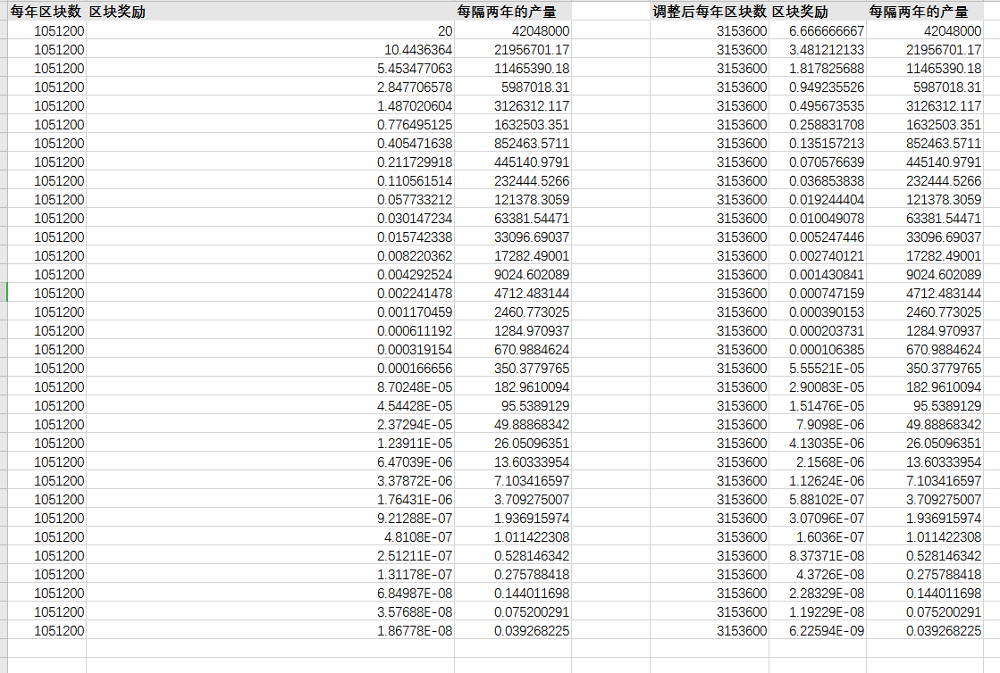

# 11. Economic Model
## 11.1  Total Amount
&#160;&#160;&#160;&#160;&#160;&#160;The total  amount is constant at 590 million WDC

|Number| Type|Explanation|Amount
|:----:|:----:|:----:|:----:
|1 | Consensus of main chain|Issued in the form of miners' Awards|88000000
|2| Total incubator initial balance|Set an address|35765823
|3|Official initial|30 addresses|177000000
|4|User initialization|User's original incubation data|289234177
|Total|590000000

## 11.2 Release Curve
&#160;&#160;&#160;&#160;&#160;&#160;The initial output block time of the public chain is 30 seconds,and 20 WDC will be rewarded for each block. After 2102400 blocks (about 2 years), the number will decrease by about 52.22%, until the block reward is adjusted to 6.66666666 WDC. Therefore, except for the first interest rate reduction block height adjusted to 5736000 blocks, the latter interest rate reduction rate is fixed at 6307200 blocks.

## 11.3  Service Charge
&#160;&#160;&#160;&#160;&#160;&#160;The service charge of a transaction is equal to the transaction gas multiplied by gasPrice. The gas of different transaction types is different. Multiplied by gasPrice equals to the service charge. The service charge is 0.002 WDC by default. If you want to pay more service charge, you only need to add gasPrice. The gas table of the transaction is as follows:

|Number| Transaction type|Explanation
|:----:|:----:|:----:|
|1| coinbase|0Gas
|2| general transfer|50000Gas
|3|vote|20000Gas
|4|certificate storage|100000Gas
|5|deployment contract|100000Gas
|6|call contract|100000Gas
|7|apply for incubation|100000Gas
|8|withdraw  interest|100000Gas
|9|withdraw share|100000Gas
|10|Withdraw principal|100000Gas
|11|Withdraw vote|20000Gas
|12|mortgage|20000Gas
|13|withdraw mortgage|20000Gas
