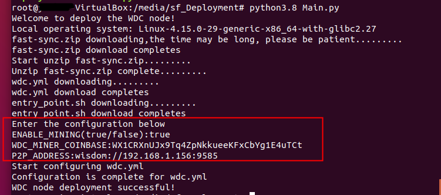

# 二、WisdomChain客户端
## 2.1 客户端种类
&#160;&#160;&#160;&#160;&#160;&#160;全节点和矿工节点
## 2.2 核心节点部署
### 2.2.1 配置网络防火墙
&#160;&#160;&#160;&#160;&#160;&#160;WisdomChain P2P和RPC默认端口均为19585，在docker容器端口映射时，可根据需求修改。请根据需求修改网络防火墙设置，决定是否开放该端口。

### 2.2.2服务器硬件
&#160;&#160;&#160;&#160;&#160;&#160;磁盘空间建议 500GB，内存16GB，CPU 8核。

### 2.2.3安装docker、docker-compose

#### 	2.2.3.1 Ubuntu

```
apt install -y docker-compose
```

#### 	2.2.3.2 CentOS

```
yum install -y docker

sudo curl -L "https://github.com/docker/compose/releases/download/1.24.0/docker-compose-$(uname-s)-$(uname-m)" -o/usr/local/bin/docker-compose

sudo chmod +x /usr/local/bin/docker-compose
```

### 2.2.4 Docker镜像地址
&#160;&#160;&#160;&#160;&#160;&#160;		节点程序镜像：wisdomchain/wdc_core

&#160;&#160;&#160;&#160;&#160;&#160;
数据库镜像：wisdomchain/wdc_pgsql

### 2.2.5 wdc.yml文件示例
<font color=red>* 以下内容为示例性内容，实际部署时，卷映射、环境变量、端口映射等根据实际情况，需要调整。</font>
```yml
version: '3.1'

services:

    wdc_pgsql:
        image: wisdomchain/wdc_pgsql
        restart: always
        container_name: wdc_pgsql
        privileged: true
        volumes:
            -/opt/wdc_pgsql:/var/lib/postgresql/data # pgsql 数据目录
        ports:
            -127.0.0.1:5433:5432
        environment:
            POSTGRES_USER: wdcadmin
            POSTGRES_PASSWORD: PqR_w9hk6Au-jq5ElsFcEjq!wvULrYXeF3*oDKp5i@A/D5m03VaB1M/hyKY
            WDC_POSTGRES_USER: replica
            WDC_POSTGRES_PASSWORD: replica

    wdc_core:
        image: wisdomchain/wdc_core
        restart: always
        container_name: wdc_core
        privileged: true
        volumes:
            -/opt/wdc_logs:/logs #程序日志目录
            -/opt/wdc_leveldb:/leveldb
            -./entry_point.sh:/entry_point.sh
            -/opt/ipc:/root/ipc
            -./libs:/libs
            -/opt/fast-sync:/fast-sync
        entrypoint: /usr/bin/env bash /entry_point.sh -d wdc_pgsql:5432 -c '/usr/bin/env bash /run_wdc_core.sh'
        ports:
            -19585:19585
            -9585:9585
        environment:
            LOGGING_CONFIG: 'https://wisdom-config.oss-cn-hangzhou.aliyuncs.com/public-chain/logback.xml' #如发现LOGGING_CONFIG相关路径报错，可以去除此项
            DATA_SOURCE_URL: 'jdbc:postgresql://wdc_pgsql:5432/postgres'
            DB_USERNAME: 'replica'
            DB_PASSWORD: 'replica'
            WDC_MINER_COINBASE: 'WX1********XN1T21573hYata'
            P2P_MODE: 'grpc'
            P2P_ADDRESS: 'wisdom://192.**.***.156:9585'
            BOOTSTRAPS: 'wisdom://47.74.183.249:9585,wisdom://47.74.216.251:9585,wisdom://47.96.67.155:9585,wisdom://47.74.86.106:9585'
            MAX_BLOCKS_PER_TRANSFER: '256'
            ENABLE_DISCOVERY: 'true'
            ENABLE_MINING: 'true'
            FAST_SYNC_DIRECTORY: '/fast-sync'
            DATABASE_DIRECTORY: '/leveldb'
```

### 2.2.6 卷映射（volumes）
&#160;&#160;&#160;&#160;&#160;&#160;可根据需要，映射到不同的目录。

&#160;&#160;&#160;&#160;&#160;&#160;其中，wdc_pgsql volumes映射的是PostgreSql数据库数据目录，docker容器删除后，该目录不会自动删除，节点数据仍然保留。如果想要全新启动WDC Core，请备份该目录后，删除或清空该目录。

&#160;&#160;&#160;&#160;&#160;&#160;wdc_core volumes映射的是WDC Core节点程序日志目录。

&#160;&#160;&#160;&#160;&#160;&#160;容器内部的一些文件，也可以根据需要映射到宿主机目录。比如wdc_core容器内部的/fast-sync，可以映射为： /opt/fast-sync:/fast-sync。

### 2.2.7 网络端口映射（ports）
&#160;&#160;&#160;&#160;&#160;&#160;wdc_pgsql的端口映射，为了保障安全，建议映射到IP地址127.0.0.1，只允许本机访问。如果不想通过外部客户端访问数据库，也可以去掉该端口映射。

&#160;&#160;&#160;&#160;&#160;&#160;wdc_pgsql和wdc_core的外部端口号，可根据需求修改。

### 2.2.8 环境变量（environment）
&#160;&#160;&#160;&#160;&#160;&#160;数据库用户名密码可以自定义，但要保证WDC_POSTGRES_USER与DB_USERNAME保持一致，WDC_POSTGRES_PASSWORD与DB_PASSWORD一致

&#160;&#160;&#160;&#160;&#160;&#160;ENABLE_MINING 表示是否启动挖矿

&#160;&#160;&#160;&#160;&#160;&#160;WDC_MINER_COINBASE 为挖矿coinbase地址，必须设置，否则节点无法启动。生成地址的方法参见下一节“矿工地址生成”

&#160;&#160;&#160;&#160;&#160;&#160;DATA_SOURCE_URL 的值，利用docker容器互联，不必修改。如果需要修改，需确保URL中的主机名为pgsql容器名，端口与pgsql容器内部的数据库端口相同

&#160;&#160;&#160;&#160;&#160;&#160;BOOTSTRAPS：种子节点列表，英文逗号分隔

&#160;&#160;&#160;&#160;&#160;&#160;ENABLE_DISCOVERY：是否允许节点发现，true/false

&#160;&#160;&#160;&#160;&#160;&#160;P2P_ADDRESS：自己节点ip、port

&#160;&#160;&#160;&#160;&#160;&#160;ports：9585是p2p端口，19585是rpc端口

&#160;&#160;&#160;&#160;&#160;&#160;MAX_BLOCKS_PER_TRANSFER：最大同步区块数（官方建议默认256）

&#160;&#160;&#160;&#160;&#160;&#160;FAST_SYNC_DIRECTORY: '/fast-sync'：快照文件路径（此路径为容器内的路径，需要与wdc.yml中配置volumes下的保持一致）

&#160;&#160;&#160;&#160;&#160;&#160;DATABASE_DIRECTORY: '/leveldb'：leveldb存储路径（此路径为容器内的路径，需要与wdc.yml中配置volumes下的保持一致）

### 2.2.9 矿工地址生成
&#160;&#160;&#160;&#160;&#160;&#160;使用手机APP生成地址。APP可在官网下载： https://www.wisdchain.com/

&#160;&#160;&#160;&#160;&#160;&#160;目前下载页面为： https://www.wisdchain.com/user/application_1

### 2.2.10 准备entry_point.sh
&#160;&#160;&#160;&#160;&#160;&#160;wdc.yml文件中，wdc_core服务的入口脚本内容：

```shell
#!/bin/bash
#set -x
#******************************************************************************
# @file    : entrypoint.sh
# @author  : wangyubin
# @date    : 2018-08- 1 10:18:43
#
# @brief   : entry point for manage service start order
# history  : init
#******************************************************************************

: ${SLEEP_SECOND:=2}

wait_for() {
    echo Waiting for $1 to listen on $2...
    while ! nc -z $1 $2; do echo waiting...; sleep $SLEEP_SECOND; done
}

declare DEPENDS
declare CMD

while getopts "d:c:" arg
do
    case $arg in
        d)
            DEPENDS=$OPTARG
            ;;
        c)
            CMD=$OPTARG
            ;;
        ?)
            echo "unkonw argument"
            exit 1
            ;;
    esac
done

for var in ${DEPENDS//,/ }
do
    host=${var%:*}
    port=${var#*:}
    wait_for $host $port
done

eval $CMD

```

### 2.2.11 数据快照：
数据快照下载链接：https://wisdom-backup.oss-cn-beijing.aliyuncs.com/fast-sync.zip
<br>解压并把快照文件放入（官方建议，有需要可以自定义路径，在wdc.yml中修改）/opt/fast-sync路径下。
<br>如有新数据快照请关注官方公众号。

### 2.2.12 启动docker镜像
&#160;&#160;&#160;&#160;&#160;&#160;更新镜像：
```
docker pull wisdomchain/wdc_core
	
docker pull wisdomchain/wdc_pgsql
	
docker-compose -f wdc.yml up -d
```

### 2.2.13 查看日志
&#160;&#160;&#160;&#160;&#160;&#160;命令 docker logs -f <CONTAINER ID> 查看节点程序控制台输出/opt/wdc_logs目录为节点程序日志文件目录，如果再YML文件映射到了其他目录，请到相应目录查看。

## 2.3 节点启动流程

```
//停止并删除容器，确保节点没有启动
docker-compose -f wdc.yml down

//获得最新版本镜像
docker pull wisdomchain/wdc_core

//修改wdc.yml，如果有必要的话

//启动新版镜像
docker-compose -f wdc.yml up -d
```
## 2.4 一键部署
### 2.4.1 部署准备工作
&#160;&#160;&#160;&#160;&#160;&#160;官方指定操作系统为Linux ubuntu18+64位，准备好操作系统后需要先安装部署Python，Python最低版本3.8.0，安装成功后用python3.8 --version查看安装是否正常（安装方式不同，指令根据安装方式查看）
</br>


&#160;&#160;&#160;&#160;&#160;&#160;安装docker、docker-compose,具体安装步骤可参考 2.2.3安装docker、docker-compose

### 2.4.2 自动化部署
注:选用root或有管理员权限的用户执行下面的部署
```python
#!/usr/bin/env python
# -*- coding: utf-8 -*-
# @Time    : 2020/03/30 10:01
# @Author  : Yun Min
# @File    : Main.py

import platform
import os
import os.path
import zipfile
import time
import json
import sys
import re
import ssl

from urllib import request

fast_url = "https://wisdom-backup.oss-cn-beijing.aliyuncs.com/fast-sync.zip"
root_dir = "/opt/"
fast_name = "fast-sync.zip"
wdc_url = "https://wisdom-backup.oss-cn-beijing.aliyuncs.com/wdc.yml"
wdctest_name = "wdc-test.yml"
wdc_name = "wdc.yml"
entrypoint_url = "https://wisdom-backup.oss-cn-beijing.aliyuncs.com/entry_point.sh"
entrypoint_name = "entry_point.sh"
envfile_name = "env.json"
profileList = {'ENABLE_MINING': '', 'P2P_ADDRESS': '', 'WDC_MINER_COINBASE': ''}
global numb
numb = 0
global count
count = 0

ssl._create_default_https_context = ssl._create_unverified_context


def main():
    print("Welcome to deploy the WDC node!")
    usePlatform()
    path = os.getcwd()
    os.chdir(root_dir)
    downloadFast()
    os.chdir(path)
    downloadWdc()
    propValue()
    updateWdc()
    print("WDC node deployment successful!")


def downloadWdc():
    try:
        if os.path.exists(wdctest_name):
            pass
        else:
            print("wdc.yml downloading.........")
            f = request.urlopen(wdc_url)
            data = f.read()
            with open(wdctest_name, "wb") as code:
                code.write(data)
        print("wdc.yml download completes")
        time.sleep(1)
        if os.path.exists(entrypoint_name):
            pass
        else:
            print("entry_point.sh downloading.........")
            f = request.urlopen(entrypoint_url)
            data = f.read()
            with open(entrypoint_name, "wb") as code:
                code.write(data)
        print("entry_point.sh download completes")
    except:
        print("Download exception, please check the network condition")
        sys.exit()


def downloadFast():
    try:
        if os.path.exists(root_dir + fast_name):
            pass
        else:
            print("fast-sync.zip downloading,the time may be long, please be patient.........")
            f = request.urlopen(fast_url)
            data = f.read()
            with open(fast_name, "wb") as code:
                code.write(data)
        print("fast-sync.zip download completes")
        time.sleep(1)
        print("Start unzip fast-sync.zip.........")
        zip_file = zipfile.ZipFile(fast_name)
        if os.path.exists(root_dir + fast_name):
            pass
        else:
            print("There is no fast_sync.zip in the current path,Please rerun")
            sys.exit()
        for names in zip_file.namelist():
            zip_file.extract(names, root_dir)
        zip_file.close()
        print("Unzip fast-sync.zip complete.........")
    except Exception as e:
        # print(e.message)
        print("Download exception, please check the network condition")
        sys.exit()


def updateWdc():
    print("Start configuring wdc.yml")
    f = open(wdctest_name, 'r', encoding='utf-8')
    f_new = open(wdc_name, 'w', encoding='utf-8')

    for line in f:
        if "$$test1$$" in line:
            line = line.replace('$$test1$$', profileList['ENABLE_MINING'])
        elif "$$test2$$" in line:
            line = line.replace('$$test2$$', profileList['WDC_MINER_COINBASE'])
        elif "$$test3$$" in line:
            line = line.replace('$$test3$$', profileList['P2P_ADDRESS'])
        f_new.write(line)
    f.close()
    f_new.close()
    remove(wdctest_name)
    print("Configuration is complete for wdc.yml")


def propValue():
    if not os.path.exists(envfile_name):
        print("Enter the configuration below")
        wirteJson()
    else:
        getJson()


def getJson():
    try:
        with open(os.getcwd() + "/" + envfile_name, 'r') as profile:
            load_dict = json.load(profile)
            if checkEnablemining(load_dict['ENABLE_MINING']) == 0 and checkWdcaddress(
                    load_dict['WDC_MINER_COINBASE']) == 0 and checkP2paddress(load_dict['P2P_ADDRESS']) == 0:
                profileList['ENABLE_MINING'] = load_dict['ENABLE_MINING']
                profileList['WDC_MINER_COINBASE'] = load_dict['WDC_MINER_COINBASE']
                profileList['P2P_ADDRESS'] = load_dict['P2P_ADDRESS']
                return
            profile.close()
            print("An exception occurred. Please enter again")
            remove(os.getcwd() + "/" + envfile_name)
            propValue()
    except:
        print("An exception occurred. Please enter again")
        remove(os.getcwd() + "/" + envfile_name)
        propValue()


def wirteJson():
    global numb
    numb += 1
    global count
    count += 1
    if numb == 4:
        remove(envfile_name)
        print("The normal exit")
        sys.exit()
    with open(os.getcwd() + "/" + envfile_name, 'w') as profile:
        if not profileList['ENABLE_MINING']:
            enablemining = input("ENABLE_MINING(true/false):")
            if checkEnablemining(enablemining) == 1:
                profile.close()
                print("Illegal input, please re-enter")
                count = 0
                wirteJson()
            profileList['ENABLE_MINING'] = enablemining
            numb = 1
        if profileList['ENABLE_MINING'] == 'true' and not profileList['WDC_MINER_COINBASE']:
            if count > 1:
                pass
            else:
                minercoinbase = input("WDC_MINER_COINBASE:")
                if checkWdcaddress(minercoinbase) == 1:
                    print("WDC_MINER_COINBASE can not be empty or is not valid, please enter it again")
                    profile.close()
                    count = 0
                    wirteJson()
                profileList['WDC_MINER_COINBASE'] = minercoinbase
                numb = 1
        if not profileList['P2P_ADDRESS']:
            p2paddress = input("P2P_ADDRESS:")
            if checkP2paddress(p2paddress) == 0:
                profileList['P2P_ADDRESS'] = p2paddress
                json.dump(profileList, profile)
                return
            profile.close()
            print("P2P_ADDRESS address is not valid, please enter it again")
            wirteJson()


def checkEnablemining(enablemining):
    if enablemining != 'true' and enablemining != 'false':
        return 1
    return 0


def checkWdcaddress(minercoinbase):
    if minercoinbase == "":
        return 1
    if str(minercoinbase[0:2]) != "WX":
        return 1
    if len(minercoinbase) != 35 and len(minercoinbase) != 36:
        return 1
    return 0


def checkP2paddress(p2paddress):
    list = p2paddress.split(':')
    if len(list) != 3:
        return 1
    if list[0] != 'wisdom':
        return 1
    if list[1][0:2] != "//":
        return 1
    ip = list[1].split("//")
    if re.match(r"^(?:(?:25[0-5]|2[0-4][0-9]|[01]?[0-9][0-9]?)\.){3}(?:25[0-5]|2[0-4][0-9]|[01]?[0-9][0-9]?)$", ip[1]):
        pass
    else:
        return 1
    port = int(list[2])
    if port < 0 or port > 65535:
        return 1
    return 0


def remove(pathname):
    if os.path.exists(pathname):
        os.remove(pathname)


def usePlatform():
    sysstr = platform.system();
    if (sysstr == "Linux"):
        print("Local operating system: " + platform.platform())
    else:
        print("Please check whether the operating system is Linux")
        sys.exit()


main()
```

把Main.py放入到服务器相应文件下后，执行python3.8 Main.py<br>A.出现”<font color=green>Welcome to deploy the WDC node!</font>”表示程序启动成功<br>
B.下面的步骤会自动下载快速同步区块和相应启动脚本<br>
C.出现以下字段需要用户配置，按回车键继续（注意输入不要留空格）
<br>&#160;&#160;&#160;&#160;&#160;&#160;<font color=green>ENABLE_MINING(true/false): #表示节点是否挖矿，true是启动，false是不启动
<br>&#160;&#160;&#160;&#160;&#160;&#160;WDC_MINER_COINBASE: #表示矿工地址，用WisdomChain工具或钱包生成WisdomChain 2.0版本地址（只支持带前缀“WX”），如果之前的ENABLE_MINING是false,不会有这提示
<br>&#160;&#160;&#160;&#160;&#160;&#160;P2P_ADDRESS: #表示节点IP地址
<br>&#160;&#160;&#160;&#160;&#160;&#160;	  格式示例为：wisdom://192.168.1.57:9585
<br>&#160;&#160;&#160;&#160;&#160;&#160;	  矿工节点IP地址设置外网IP，全节点可以设置外/内网IP，9585端口是默认端口，如果不是9585，需要在wdc.yml修改端口映射</font>
<br>&#160;&#160;&#160;&#160;&#160;&#160;如果需要配置其他参数，可以等部署完后再自行修改，具体参数参考 2.2.8 环境变量
<br>D.出现“<font color=green>WDC node deployment successful!</font>”表示部署成功
正常部署界面示例如下：	


### 2.4.3 报错问题
4.1 <b>“Download exception, please check the network condition”</b><br>&#160;&#160;&#160;&#160;&#160;&#160;此类错误，请检查服务器网络是否正常，用户是否是root或是有管理员权限用户

4.2 <b>“An exception occurred. Please enter again”</b><br>&#160;&#160;&#160;&#160;&#160;&#160;
此类错误，配置参数的json文件出现问题，会重新让用户配置，如果没有让用户重新配置，把env.json删除掉后，重新执行部署工具

4.3 <b>程序卡在“fast-sync.zip downloading,the time may be long, please be patient.........”后很长时间不动</b>

<br>&#160;&#160;&#160;&#160;&#160;&#160;此类错误，查看用户是否是root或是有管理员权限用户在执行部署工具，或者是/opt/文件路径不存在，需手动创建下

4.4 <b>“Please check whether the operating system is Linux”</b>

&#160;&#160;&#160;&#160;&#160;&#160;此类错误，操作系统不是linux操作系统

4.5 <b>“There is no fast_sync.zip in the current path,Please rerun”</b>

&#160;&#160;&#160;&#160;&#160;&#160;此类错误，快速同步fast_sync.zip压缩包检测不到，重新执行脚本工具

4.6 <b>“The normal exit”</b>

&#160;&#160;&#160;&#160;&#160;&#160;此类错误，输入错误数据超过三次，程序自动退出，请检查所输参数是否合法

### 2.4.5 启动节点
&#160;&#160;&#160;&#160;&#160;&#160;执行 docker-compose -f wdc.yml up -d 启动节点程序，新节点可以直接启动，如果是之前部署过的节点，需要重新pull下最新代码镜像，具体参考 2.3 节点启动流程

## 2.5 参数配置

|参数项| 参数说明|作用
|---|---|---
|<div style="width:155pt">DATA_SOURCE_URL</div> | <div style="width:70pt">数据库配置</div>|默认为```jdbc:postgresql://wdc_pgsql:5432/postgres```，利用docker容器互联，不必修改。如果需要修改，需确保URL中的主机名为pgsql容器名，端口与pgsql容器内部的数据库端口相同
|DB_USERNAME|数据库名称|默认为replica
|DB_PASSWORD|数据库密码|默认为replica
|ENABLE_MINING|是否开启挖矿|true是开启，false是关闭
|WDC_MINER_COINBASE|矿工地址|WDC生成的地址
|P2P_MODE|通讯模式|grpc
|P2P_ADDRESS|节点地址|模式为wisdom://192.168.1.156:9585
|BOOTSTRAPS|种子节点|默认为wisdom://47.74.183.249:9585,wdom://47.74.216.251:9585,wisdom://47.96.67.155:9585,wisdom://47.74.86.106:9585
|MAX_BLOCKS_PER_TRANSFER|最大同步区块数|默认256
|ENABLE_DISCOVERY|是否开启节点发现|true是开启，false是关闭
|FAST_SYNC_DIRECTORY|快照文件路径（此路径为容器内的路径，需要与wdc.yml中配置volumes下的保持一致）|/fast-sync
|DATABASE_DIRECTORY|leveldb存储路径（此路径为容器内的路径，需要与wdc.yml中配置volumes下的保持一致）|/leveldb


## 2.6 控制台工具
详见：
https://github.com/WisedomChainGroup/java-wisdomcore/tree/master/wisdom-core/src/main/java/org/wisdom/ipc

