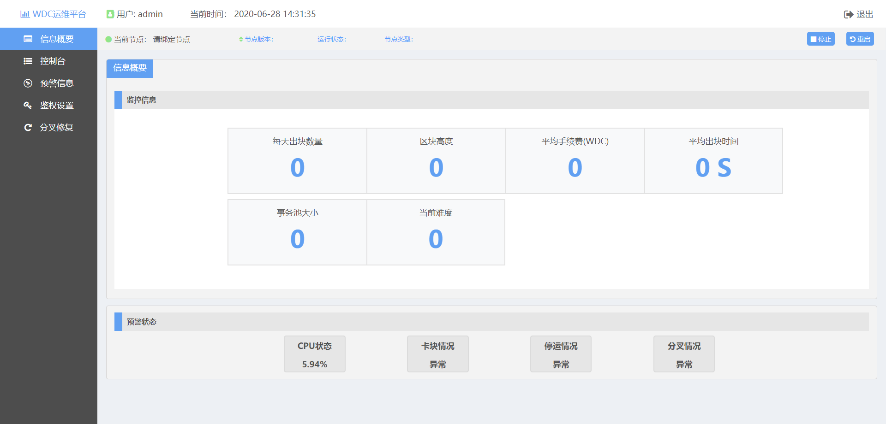
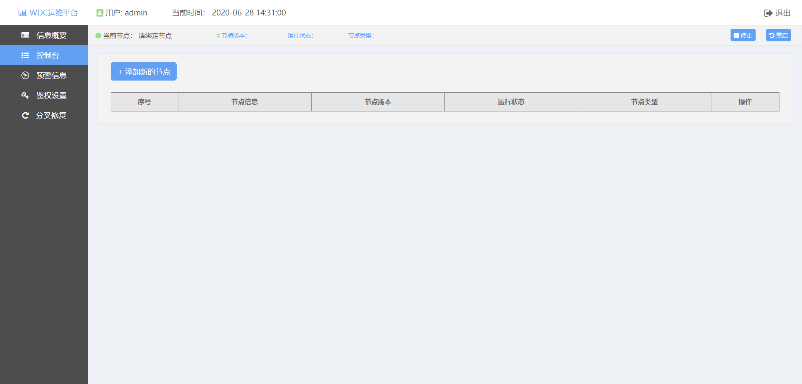

# 十四 、 节点监控服务
## 14.1 安装部署
&#160;&#160;&#160;&#160;&#160;&#160;详见： https://github.com/WisedomChainGroup/wisdom-operations

&#160;&#160;&#160;&#160;&#160;&#160;拉取最新releases，解压并修改config/application.properties配置文件，java-jar
monitor.jar直接启动jar包。

|参数项 | 参数名称|作用
|:----:|:----:|:----:
|数据库的 JDBC URL | DATA_SOURCE_URL|连接数据库
|数据库 用户名| DB_USERNAME|连接数据库
|数据库 密码|DB_PASSWORD|连接数据库
|操作系统密码|System_Password|root密码

## 14.2 功能说明
&#160;&#160;&#160;&#160;&#160;&#160;1)分叉恢复

&#160;&#160;&#160;&#160;&#160;&#160;实时检测数据同步情况，如果发现有分叉的情况出现则删除对应的分叉，数据继续
同步。10s/次监听绑定的节点，当发现区块哈希不满足与2/3邻居节点一致时，停止节
点镜像，删除对应区块并重启节点重新同步。

&#160;&#160;&#160;&#160;&#160;&#160;2)卡块监测

&#160;&#160;&#160;&#160;&#160;&#160;实时监测数据同步情况，如果发现长时间停留在一高度，则发送邮件通知出现卡块
的情况。

&#160;&#160;&#160;&#160;&#160;&#160;3)导入功能

&#160;&#160;&#160;&#160;&#160;&#160;官方提供备份数据，运维工具提供直接导入备份数据的功能。使用pg_dump导出
对应Copy的SQL语句直接在对应数据库里执行。(暂未开放)

&#160;&#160;&#160;&#160;&#160;&#160;4)导出功能

&#160;&#160;&#160;&#160;&#160;&#160;直接导出通过地址查询的事务数据到Excel。使用了POI对查询的结果进行导出。
导出字节格式数据，并恢复为关系数据。

&#160;&#160;&#160;&#160;&#160;&#160;5)预警通知

&#160;&#160;&#160;&#160;&#160;&#160;是一个可选功能，当监听节点发现出现分叉时、CPU100%占用率、节点卡块、节
点停止运行会发送邮件通知。使用了Javamail进行邮件的发送。

&#160;&#160;&#160;&#160;&#160;&#160;6)日志收集

&#160;&#160;&#160;&#160;&#160;&#160;可根据日期以及日志关键字查看、导出相应日志数据信息。(暂未开放)

&#160;&#160;&#160;&#160;&#160;&#160;7)鉴权设置

&#160;&#160;&#160;&#160;&#160;&#160;运维工具需要具备用户权限的设置，默认分为管理员、操作员与仅查询3个角色
运维工具服务端需要进行身份验证，禁止任意查询。

## 14.3 前端操作
&#160;&#160;&#160;&#160;&#160;&#160;1)登陆界面，输入用户名密码进行登陆

&#160;&#160;&#160;&#160;&#160;&#160;2)信息页面，展示基础信息

&#160;&#160;&#160;&#160;&#160;&#160;3)控制台，管理、绑定节点

&#160;&#160;&#160;&#160;&#160;&#160;4)预警信息，管理收、发邮件信息

&#160;&#160;&#160;&#160;&#160;&#160;5)鉴权设置，管理用户设置权限

