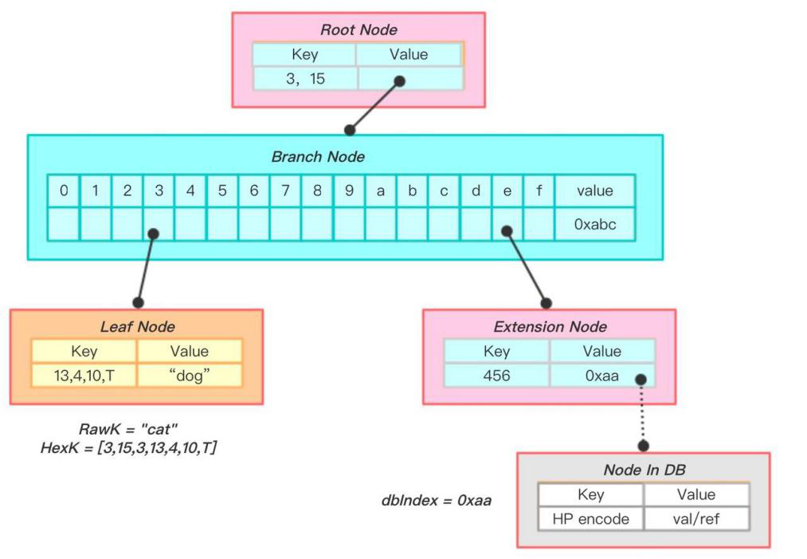

# 七、存储结构
## 7.1 区块存储
&#160;&#160;&#160;&#160;&#160;&#160;区块的存储采用PostgreSQL关系型数据库，版本号为10，其数据表分别是header、transaction、transaction_index。

&#160;&#160;&#160;&#160;&#160;&#160;header表，记录区块头信息

|编号 | 字段|类型|说明|
|:----:|:----:|:----:|:----:|
|1|block_hash|bytea|区块哈希
|2|block_notice|bytea|备注
|3|is_canonical|boolean|是否是主链区块，默认是
|4|created_at|bigint|创建时间
|5|hash_merkle_incubate|bytea|孵化状态梅克尔根
|6|hash_merkle_root|bytea|梅克尔根
|7|hash_merkle_state|bytea|梅克尔状态
|8|hash_prev_block|bytea|上一个区块哈希
|9|height|bigint|高度
|10|nbits|bytea|目标难度
|11|nonce|bytea|序号
|12|total_weight|bigint|区块总重量
|13|version|smallint|版本号

&#160;&#160;&#160;&#160;&#160;&#160;transaction表，记录事务详情

|编号| 字段|类型|说明
|:----:|:----:|:----:|:----:|
|1|tx_hash| bytea|事务哈希
|2|amount|bigint|余额
|3|from|bytea|事务from的公钥
|4|gas_price|bigint|gas单价
|5|nonce|bigint|序号
|6|payload|bytea|不同事务存放不同数据
|7|signature|bytea|事务签名
|8|to|bytae|事务to的公钥哈希
|9|type|smallint|事务类型
|10|version|smallint|版本号

&#160;&#160;&#160;&#160;&#160;&#160;transaction_index表，事务和区块的关联表

|编号 | 字段|类型|说明
|:----:|:----:|:----:|:----:|
|1|block_hash|bytea|区块哈希
|2|tx_hash|bytea|事务哈希
|3|tx_index|integer|事务所在区块序号

## 7.2 状态存储
&#160;&#160;&#160;&#160;&#160;&#160;账户的集合组成了世界状态，而账户在组成世界状态时正采用了梅克尔帕特里夏树（MPT）的组织形式，并存储在K-V型数据库中。

&#160;&#160;&#160;&#160;&#160;&#160;每个账户都处在树的叶子节点上，树的组织则按照排列顺序进行串联哈希，最终层层哈希得出世界状态。当更改某单一账户时，则会引发它所在分支的上层哈希值的更改，直到影响到根节点的哈希值，根节点的哈希值称为状态树，这个值将存入本地存储。世界状态随着区块链的前进而不断变化，状态树的值也不断变更。

## 7.3 检索结构

 &#160;&#160;&#160;&#160;&#160;&#160;前缀树是众所周知用于存储有序字符串的一种数据结构。MPT相比普通前缀树的主要优势在于它简缩的存储。如果我们在帕特里夏树中进行检索，我们将依次检索所搜索字符串中的各个字母，直到得到一条完整的路径才停止搜索（在正确的顺序下）。如果在检索完字符串（检索目标）中的所有字母之前就遇到了空指针，那就可以说该字符串并不在该前缀树中。另一方面，如果我们随着检索到达了一个叶子节点（分支末端节点），那么该路径就代表着目标字符串，可以认为目标字符串在前缀树之中。

&#160;&#160;&#160;&#160;&#160;&#160;例如在上图中，我们可以通过字符串[3,15,3,13,4,10]查找到“dog”,而cat对应的十六进制编码形式就是[3,15,3,13,4,10]，所以我们认为这个树中存在cat到dog的键值映射。